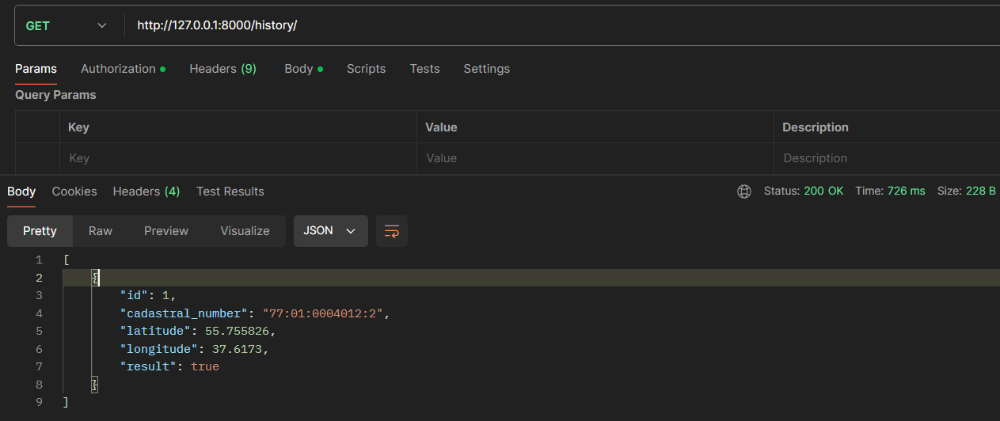
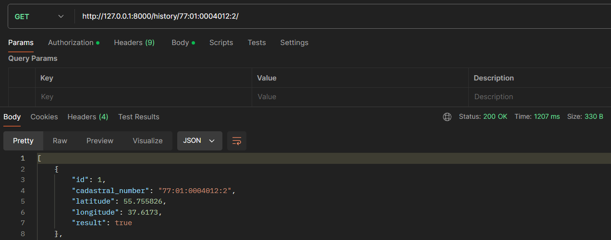
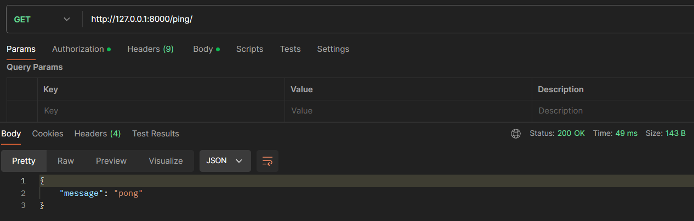
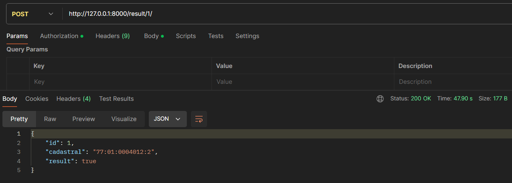
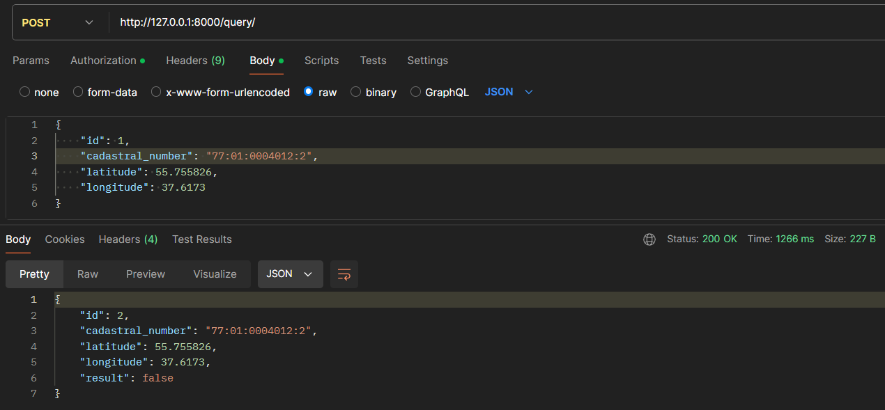
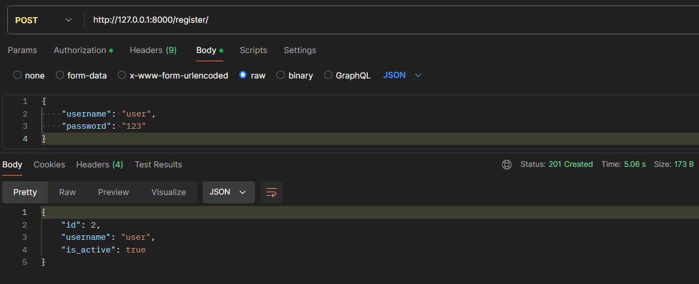
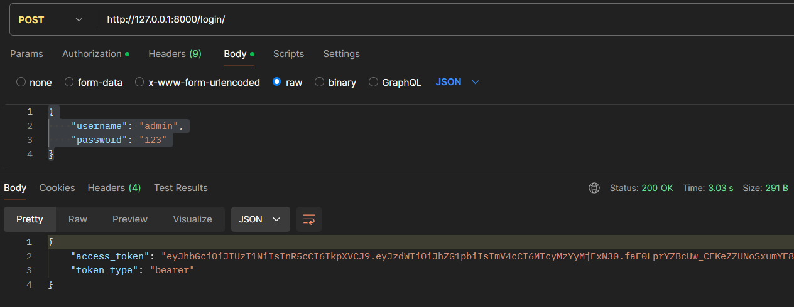
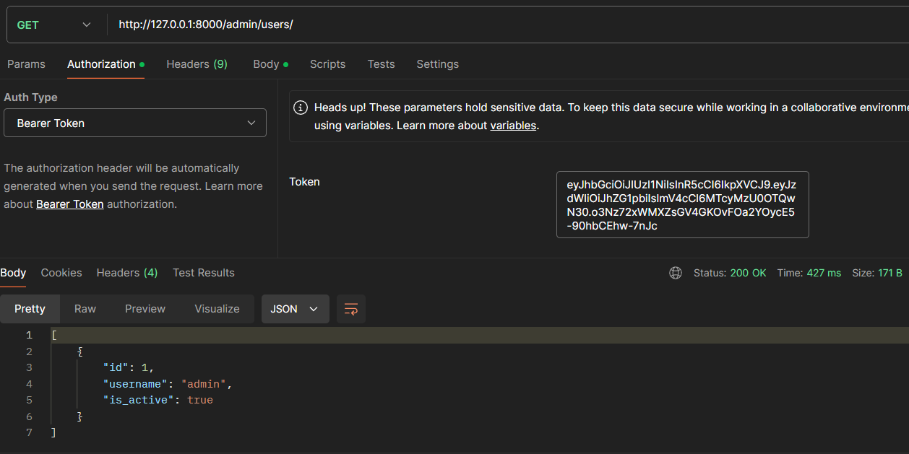

# Cadastral Service

Добро пожаловать в проект **Cadastral Service**! Этот проект представляет собой сервис для управления кадастровыми данными, включая регистрацию пользователей, авторизацию и взаимодействие с кадастровой информацией.

## Описание

**Cadastral Service** позволяет:

- Регистрация и авторизация пользователей.
- Создание и управление запросами на основе кадастровых номеров.
- Получение истории запросов по кадастровому номеру.
- Эмуляция запросов к внешним сервисам и обработка результатов.

## Технические требования

- Несколько реализаций репозитория - с использованием Редис или БД (MySQL, PostgreSQL или другие). 
- Реализация репозитория выбирается при инициализации приложения из конфигурационного файла, с указанием типа репозитория и его настройками.
- Использование ООП.

## Установка

### Клонирование репозитория

```
git clone https://github.com/samwance/CadastralService.git
```

### Создание и активация виртуального окружения
```
python -m venv venv
source venv/bin/activate  # Для Windows используйте `venv\Scripts\activate`
```
### Установка зависимостей

```
pip install -r requirements.txt
```

## Настройка
### Конфигурация репозитория
Создайте файл .env и скопируйте дынные из .env.sample

## Миграции базы данных
### Примените миграции для создания необходимых таблиц:


```
alembic upgrade head
```

### Запуск сервера разработки
```
uvicorn app.main:app --reload
```

### Docker
Вы также можете запустить проект с использованием Docker:


```
docker-compose up --build

```
## Использование
### Эндпоинты API
"/query" - для получения запроса
“/result" - для отправки результата
"/ping" - проверка, что  сервер запустился
“/history” - для получения истории запросов

- GET /history/ - для получения истории запросов
- GET /history/\<cadastral>/ - для получения запроса по кадастрововому номеру
- GET /ping/ - проверка, что  сервер запустился
- POST /result/\<query_id>/ - для отправки результата
- POST /query/ - для получения запроса
- POST /register/ - регистрация пользователя
- POST /login/ - получение токена
- GET /admin/users/ - Получение списка юзеров 
### Документация
Документацию по всем эндпоинтам можно найти по адресу:
```
/docs/
```

## Админка

### При создании миграций в базу данных добавляется суперпользователь:

- логин: admin
- пароль: 123
### входить в админку нужно с помошью токена
## Примеры запросов и ответов по эндпоитам
### Получение истории запросов
```
GET /history/
```


### Получение запроса по кадастровому номеру
```
GET /history/\<cadastral>/
```


### Проверка, что сервер запустился
```
GET /ping/
```

### Отправка результата по запросу
```
POST /result/<query_id>/
```

### для отправки запроса
```
POST /query/
Content-Type: application/json

{
    "cadastral_number": "77:01:0004012:2",
    "latitude": 55.755826,
    "longitude": 37.6173
}
```

### Регистрация пользователя
```
POST /register/
Content-Type: application/json

{
    "username": "user",
    "password": "123"
}
```

### Получение токена авторизации
```
POST /login/
Content-Type: application/json

{
    "username": "user",
    "password": "123"
}
```

### Получение списка пользователей
```
GET /admin/users/
Auth Type: Bearer Token
```
